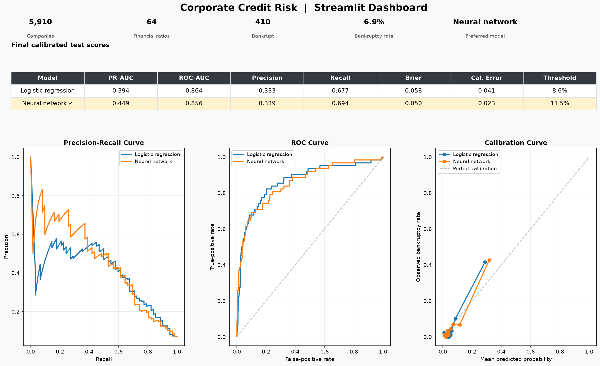

# Corporate Bankruptcy / Credit-Risk Screening

[](https://github.com/ericvannunen/credit-risk/actions/workflows/ci.yml)

An end-to-end machine-learning project for estimating whether a Polish company will become bankrupt within one year. It uses the `5year` subset of the UCI Polish Companies Bankruptcy dataset. The 64 input ratios come from the company's fifth observed year, and the target is what happened during the following year.

The project includes a complete modeling and evaluation workflow:

- Logistic regression, which is easier to understand.
- A small PyTorch neural network, which can learn nonlinear relationships.
- Optuna-based hyperparameter search for both models.
- Probability calibration and cost-sensitive threshold selection.
- A Streamlit dashboard for exploring the data and predictions.

Both models produce bankruptcy probabilities, A-E risk grades, feature explanations, and Yes/No decisions based on a selected threshold.

## Dashboard



## Results

Final test-set metrics (one holdout split, ≥70% recall target, cost policy: 5 × FN + FP):

| Model | Recall | Precision | PR-AUC | ROC-AUC | Brier | Cal. Error |
|---|---|---|---|---|---|---|
| Logistic regression | 0.677 ✗ | 0.333 | 0.394 | 0.864 | 0.058 | 0.041 |
| **Neural network** | **0.694 ✓** | **0.339** | **0.449** | **0.856** | **0.050** | **0.023** |

> ✓ met ≥70% recall target &nbsp; ✗ did not meet ≥70% recall target (still reported for comparison)

**Selected model: Neural network**  
**Reason:** met ≥70% recall while achieving lower decision cost and higher PR-AUC; also better calibrated (lower Brier score and calibration error).

## Setup

From the project root, activate the virtual environment and install the package:

```bash
source .venv/bin/activate
pip install -e .
```

Place the extracted `5year.arff` file at `data/5year.arff`.

## Run Training

Run the command-line pipeline:

```bash
python -m credit_risk.cli --data-path data/5year.arff
```

The pipeline loads the data, splits it into training, validation, and test portions, trains both models, calibrates their probabilities, selects thresholds, evaluates the untouched test set, and prints JSON results.

The current decision policy is deliberately focused on finding bankrupt companies. It requires at least 70% recall during validation and then chooses the threshold that minimizes:

```text
5 * false negatives + 1 * false positives
```

The recall target can be changed from the command line:

```bash
python -m credit_risk.cli --data-path data/5year.arff --target-recall 0.80
```

## Dashboard

Start the Streamlit dashboard:

```bash
streamlit run credit_risk/app.py
```

Open the local address shown by Streamlit, usually `http://localhost:8501`. The dashboard displays dataset statistics, calibrated test metrics, precision-recall/ROC/calibration curves, confusion matrices, and explanations for a selected test-set company.

## Search Model Settings

Optuna searches logistic-regression and neural-network settings:

```bash
python -m credit_risk.search --data-path data/5year.arff
```

For each trial, it trains on the training split, calibrates on a separate calibration split, and evaluates on a separate validation split. It selects configurations using the same policy as the main pipeline: minimum recall of 70%, then lowest validation decision cost, with PR-AUC reported as a secondary measure. The test set is not used during the search.

The output shows which settings performed best on validation. After reviewing it, copy the chosen model settings into `credit_risk/config.py` and run the normal CLI once for the final test evaluation.

## Project Structure

```text
credit_risk/
├── app.py              # Streamlit dashboard
├── calibration.py      # Sigmoid probability calibration
├── cli.py              # Command-line entry point
├── config.py           # Chosen model and training settings
├── data.py             # Dataset download and ARFF parsing
├── evaluation.py       # Splits, metrics, thresholds, and comparison
├── explanations.py     # Logistic and neural-network explanations
├── logistic_model.py   # Logistic-regression training
├── models.py           # Shared fitted-model container
├── neural_network.py   # PyTorch model and training loop
├── pipeline.py         # High-level training and JSON output
└── search.py           # Validation-only configuration search
```

## How To Read The Results

There are several metrics because they answer different questions.

- **Recall:** Of the companies that actually went bankrupt, how many did we catch? This is especially important here because missing a bankruptcy is the expensive mistake.
- **Precision:** Of the companies we flagged, how many really went bankrupt? A low value means we are sending many healthy companies for review.
- **PR-AUC:** How well does the model rank risky companies across many possible thresholds? It is useful for comparing models, but it is not the recall or precision at the threshold we chose.
- **ROC-AUC:** Another measure of ranking quality. It is less focused on the rare bankruptcy class than PR-AUC.
- **Brier score and ECE:** How trustworthy are the probability values? Lower is better.

For this project, PR-AUC is still useful, but it is not the only thing we care about. A model with a slightly better PR-AUC is not automatically better if it misses too many bankruptcies or gives poorly calibrated probabilities. The current priority is:

```text
1. Meet the minimum recall target.
2. Keep the estimated decision cost low.
3. Prefer better PR-AUC and calibration when the first two are similar.
```

The cost assumption is simple rather than a real financial calculation:

```text
Missing a bankruptcy: 5
Falsely flagging a healthy company: 1
```

So the threshold search tries to minimize:

```text
5 * false negatives + 1 * false positives
```

## What The Current Results Show

The results table near the top of this README shows the final test-set metrics for the current configuration. The neural network edges ahead of logistic regression on PR-AUC and calibration while meeting the recall target; logistic regression remains a useful, interpretable baseline.

PR-AUC summarizes ranking performance across many thresholds. Precision, recall, and the confusion matrix show what happens at the threshold selected for the project's recall and cost policy. The dashboard and CLI will recompute values if the configuration or data split changes.

These results are useful for learning and experimentation, not for real investment decisions. The data is historical and country-specific, the evaluation uses one holdout split, and the project does not yet include temporal or external validation. The test recall may also move between different datasets or time periods.

## Tests

Run the test suite with:

```bash
pytest
```